# Sprint03
# GitHub Profile Finder

A responsive web application built with **HTML**, **CSS**, and **Vanilla JavaScript** that allows users to search for any GitHub profile using the official **GitHub REST API**. The application fetches user information asynchronously and displays the latest repositories with README links.

---
##Live URL
https://github-profile-finder-seven-blond.vercel.app/

## Features

- Search any GitHub user by username.
- Fetch user data using the GitHub REST API.
- Display:
  - Profile Picture
  - Name
  - Bio
  - Join Date
  - Portfolio Website
- Display the **Top 5 Repositories**.
- Show the primary programming language used in each repository.
- Direct link to each repository's README.
- Loading spinner while data is being fetched.
- User-friendly error message if the profile is not found.
- Dark Mode / Light Mode toggle.
- Responsive design for desktop, tablet, and mobile devices.
- Theme preference saved using Local Storage.

---

## Technologies Used

- HTML5
- CSS3
- Vanilla JavaScript (ES6)
- GitHub REST API
- Font Awesome

---

## GitHub API Endpoints Used

### Fetch User

```text
https://api.github.com/users/{username}
```

### Fetch User Repositories

```text
https://api.github.com/users/{username}/repos
```

### Fetch Repository README

```text
https://api.github.com/repos/{owner}/{repository}/readme
```

---

## Project Structure

```text
GitHub-Profile-Finder/
│
├── index.html
├── style.css
├── Script.js
└── README.md
```

---

## How to Run

1. Clone the repository

```bash
git clone https://github.com/your-username/github-profile-finder.git
```

2. Open the project folder.

3. Open `index.html` in your browser.

No additional installation or dependencies are required.

---

## Application Workflow

1. User enters a GitHub username.
2. JavaScript sends a GET request to the GitHub API.
3. The application displays a loading spinner while waiting for the response.
4. If the user exists:
   - Profile information is displayed.
   - A second API request fetches repositories.
   - The latest repositories are rendered.
   - A README link is generated for each repository.
5. If the username does not exist:
   - A "User Not Found" message is displayed without crashing the application.

---

## Accessibility Features

- Semantic HTML elements
- Accessible form labels
- ARIA labels for interactive buttons and links
- Descriptive image alt text
- Keyboard-friendly interface

---

## Responsive Design

The application is fully responsive and supports:

- Desktop
- Tablet
- Mobile

using CSS Media Queries.

---

## Screenshots

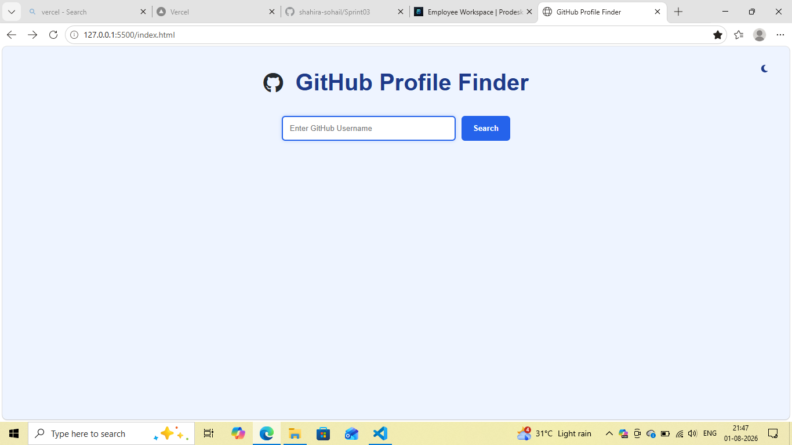
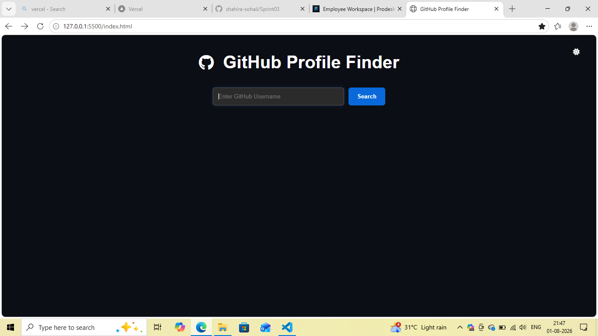
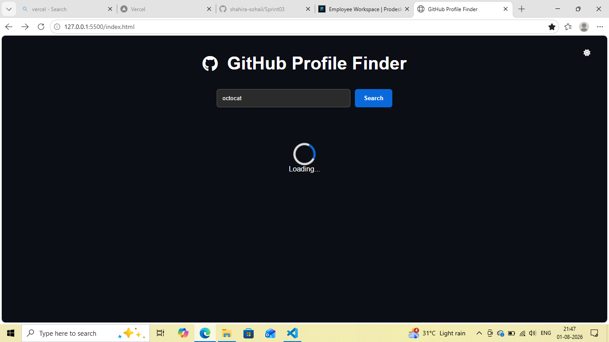
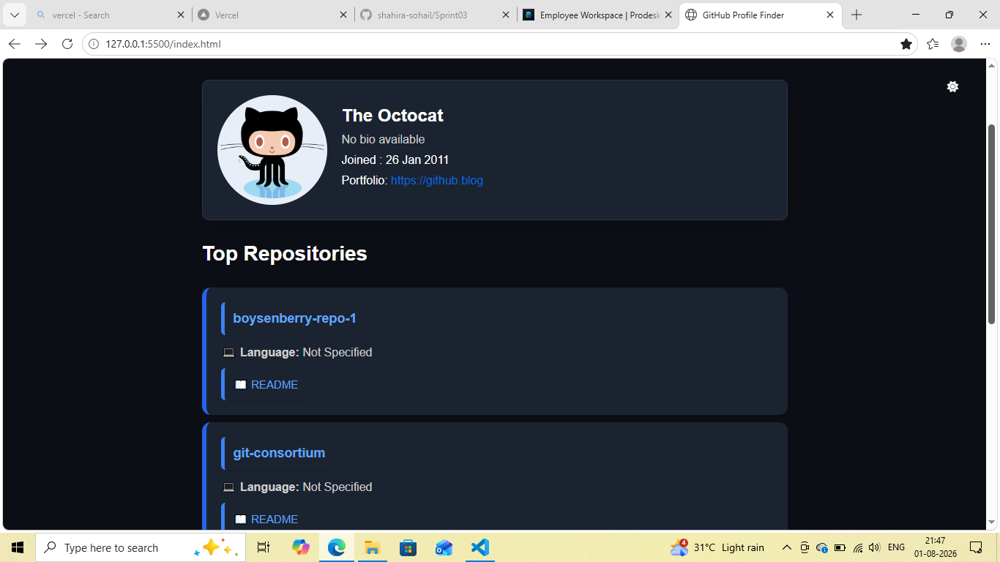
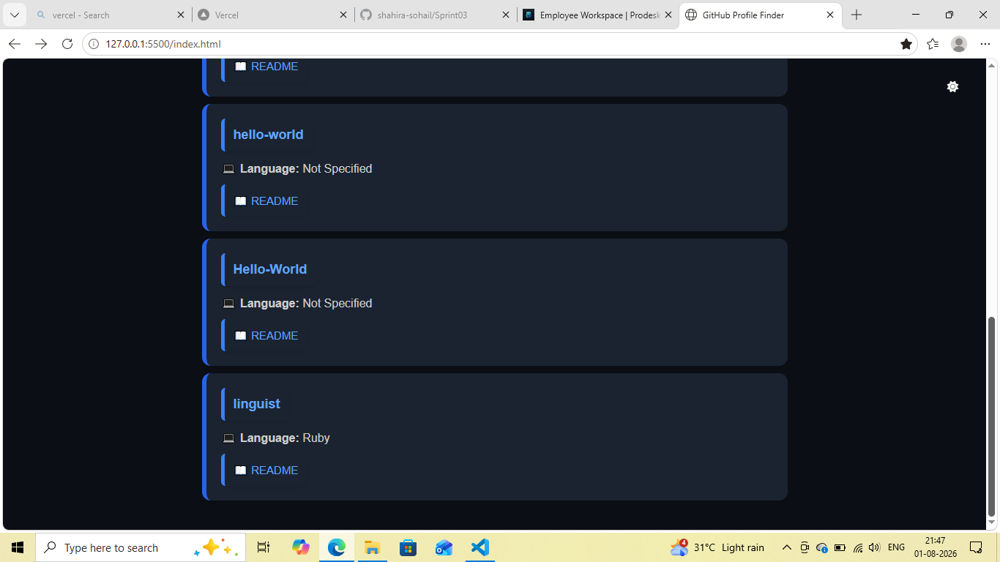
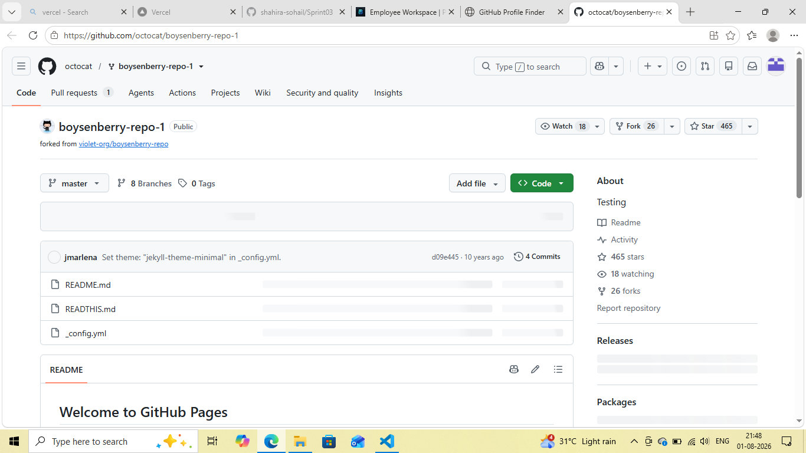
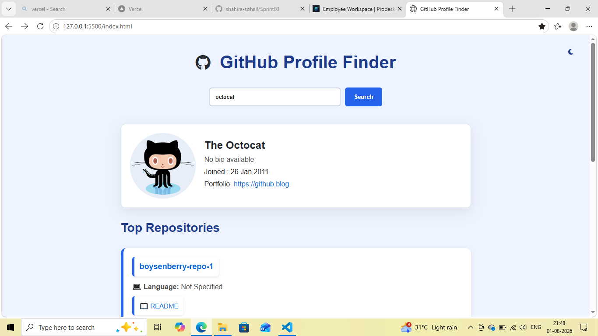
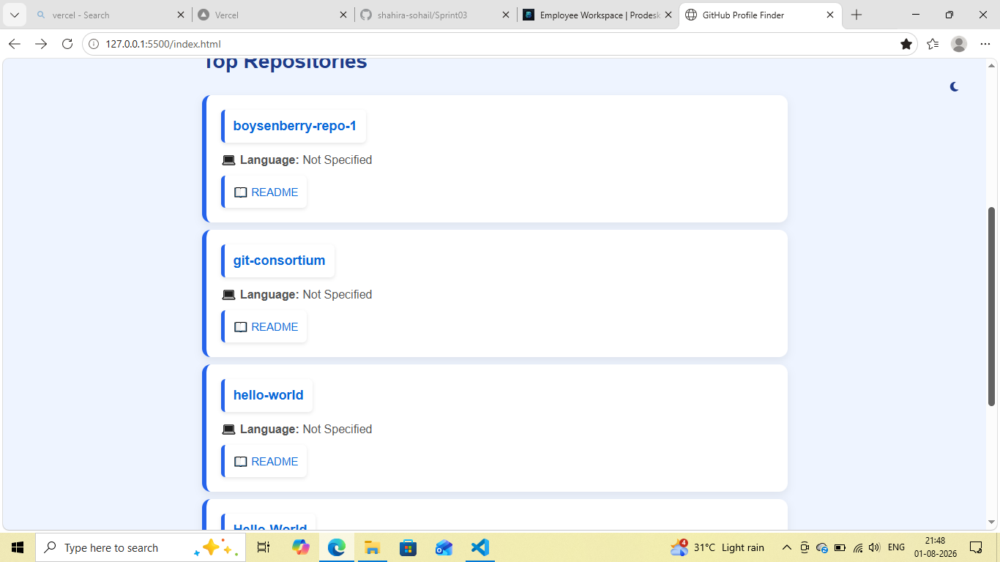
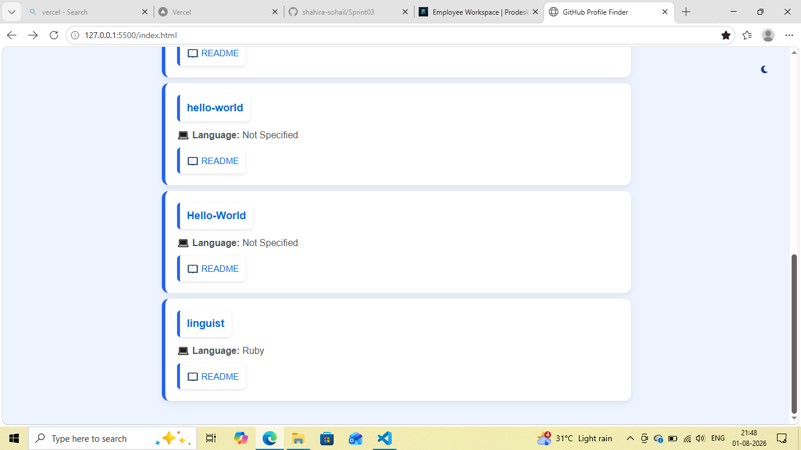
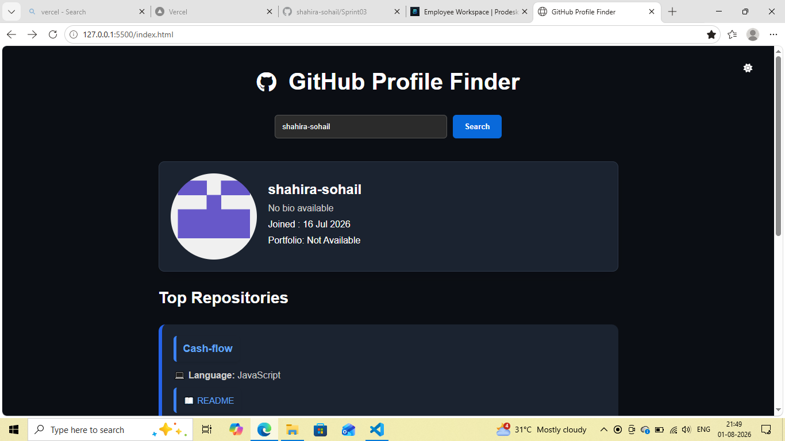
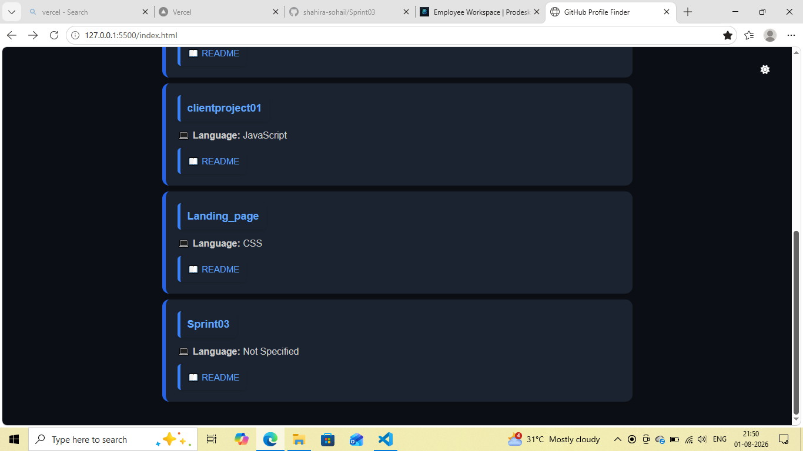
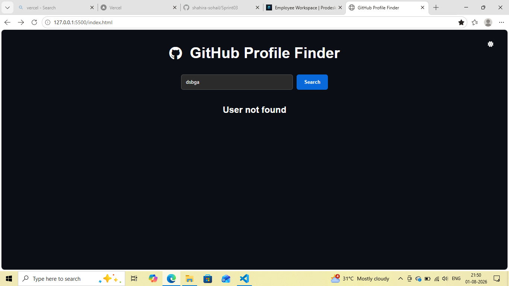

---

## Future Improvements

- Fetch repository topics.
- Display followers and following count.
- Repository search and filtering.
- Battle Mode (Compare two GitHub users).
- Repository statistics (Stars, Forks, Open Issues).
- Pagination for repositories.
- Repository sorting options.

---

## Learning Outcomes

This project helped me understand:

- Fetch API
- Async / Await
- Promises
- REST APIs
- JSON Parsing
- DOM Manipulation
- Error Handling
- Local Storage
- Responsive Web Design
- Accessibility Best Practices

---

## Author

Developed by **Shahira sohail**.
